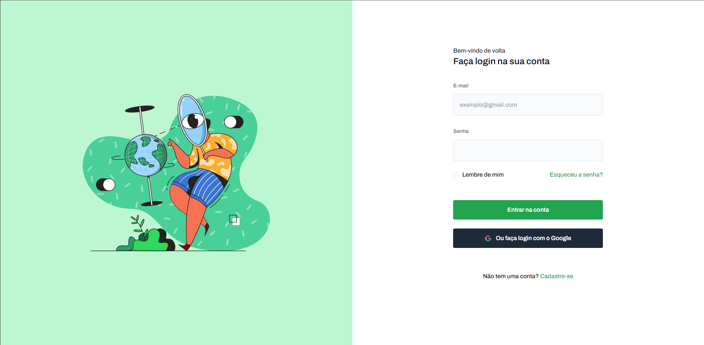
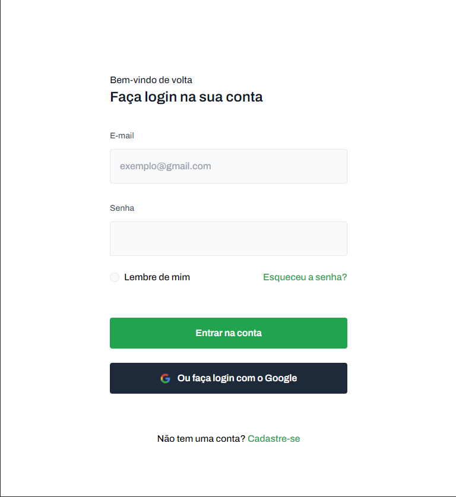
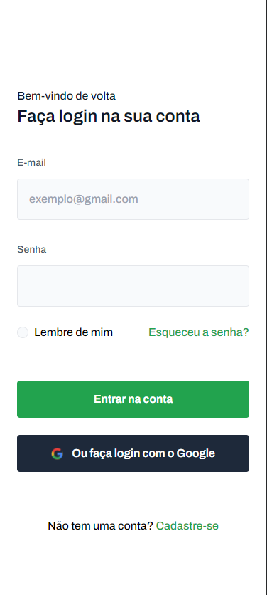

# Projeto Codelândia Login

Este projeto é um desafio frontend proposto pelo Iuri Silva @iuricode, se trata de uma tela de login com uma estrutura básica de UI contendo um formulário de login e uma imagem.

## Tecnologias Utilizadas

- HTML5
- Tailwind

## Estrutura do Projeto

```
frontend-login/
│
├── assets/
│   ├── img/
│   ├── styles.css
│   └── index.js
├── index.html
└── README.md
```

## Como Utilizar

1. Clone este repositório.
2. Abra o arquivo `index.html` em seu navegador web.

## Interface da Aplicação

A interface consiste em uma tela com um formulário de login à esquerda e uma imagem à direita.

<div style="display: flex; flex-direction: column; justify-content: center; align-items: center; gap: 20px;">
  
  
  
</div>

## Contribuição

Contribuições são bem-vindas! Caso deseje melhorar este projeto, sinta-se à vontade para enviar pull requests.

## Autor

Herlon Costa
